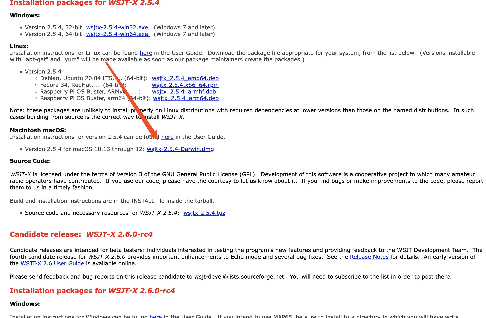
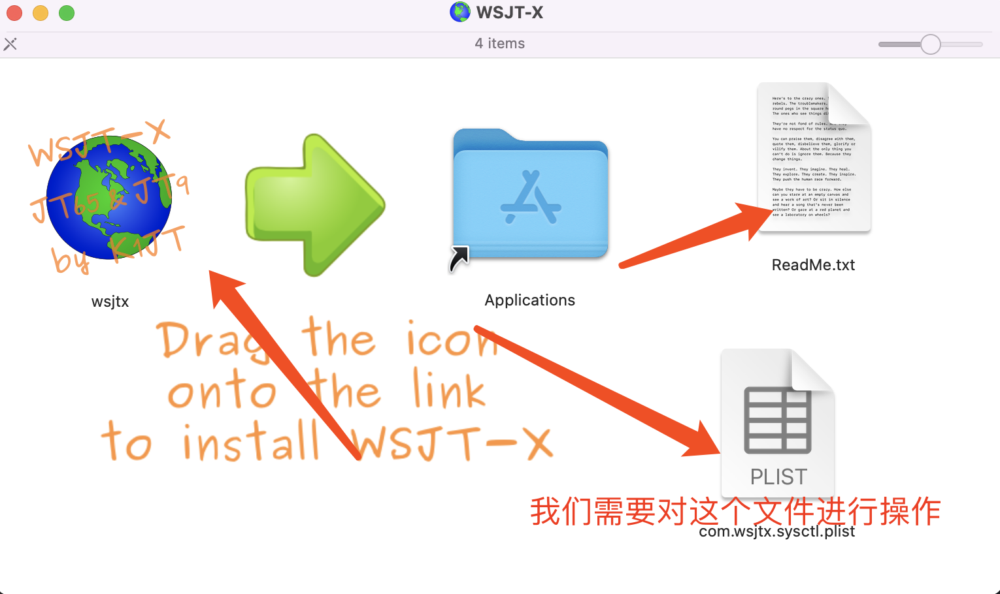
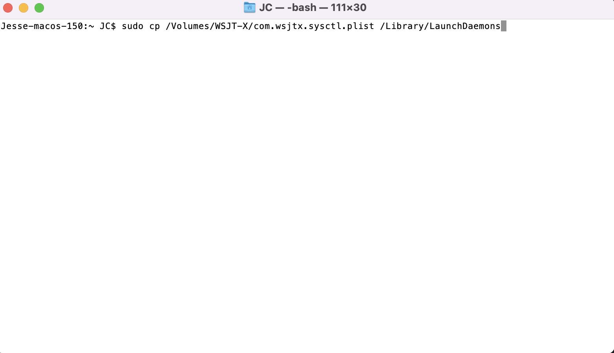
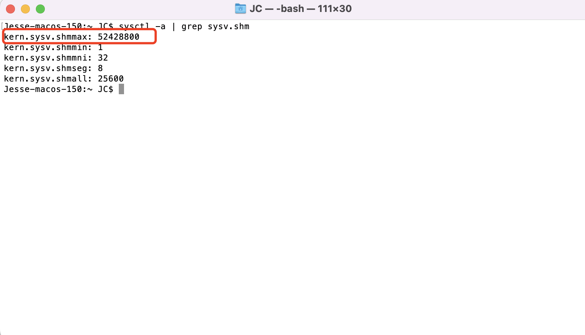
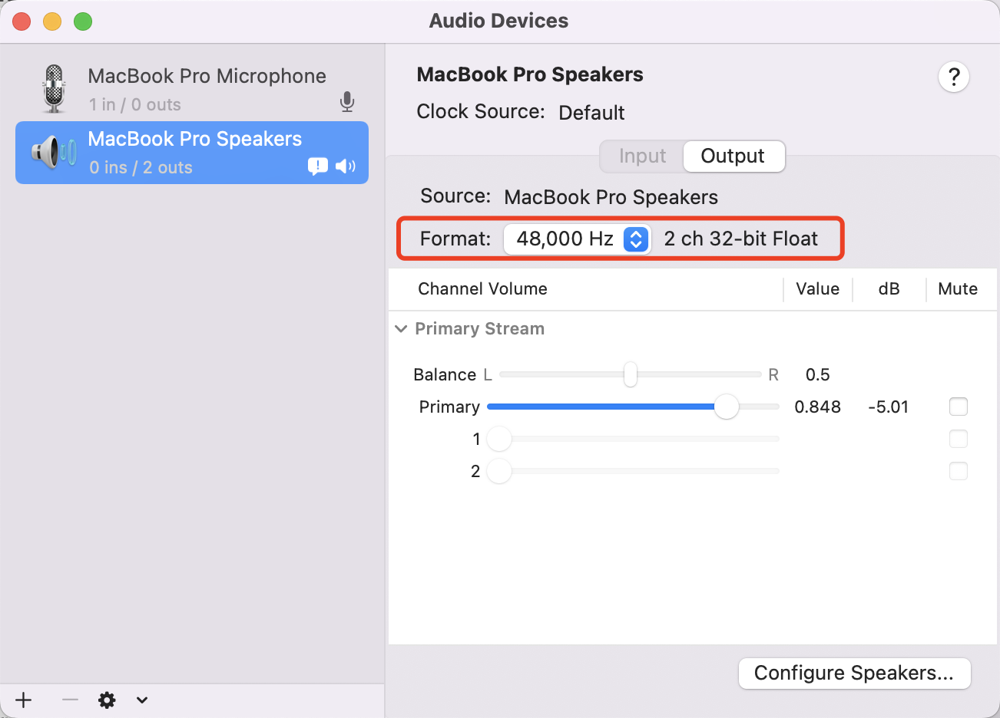
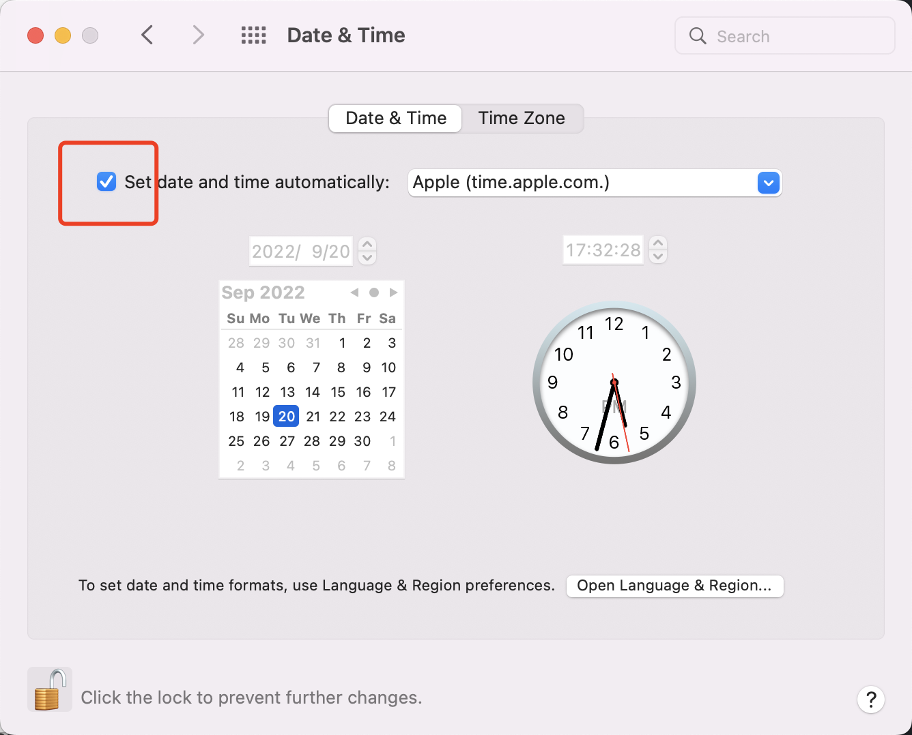

# FT-8系列之MAC安装WSJT-X

## 软件下载

玩FT-8常用的软件是WSJT-X。软件的具体设置在不同的操作系统中都是一致的，我们下一篇文章再讲。

因为笔者使用的是MacOS，这篇文章来讲一讲WSJT-X在Mac当中的下载，及软件外的环境配置。

第一步当然是下载软件WSJT-X，我们到它的官网去下载，笔者下载的版本是当前的最新版本v2.5.4。

[WSJT-X官网传送门](https://physics.princeton.edu/pulsar/k1jt/wsjtx.html)

我们下拉页面找到这里点击下载。

软件下载好后很重要的步骤就来了。我们分为3步 - 移动配置文件，修改声卡参数，同步时间

## 移动配置文件

像平常安装其他mac软件一样，首先双击下载好的`.dmg`文件，出现一个弹窗。有如图三个文件。左边的`wsjtx`很好理解，就是平常我们安装mac软件的包，关键的是右下角的文件，我们需要在安装前对它进行操作。

我们需要把`com.wsjtx.sysctl.plist`这个配置文件，放到我们一个系统文件夹当中去。方法如下:

我们打开一个terminal(中文叫做终端)。如果不知道如何打开终端，可以看[这里](https://www.xitongcheng.com/jiaocheng/dnrj_article_73564.html)

在终端里我们输入一行命令

~~~
sudo cp /Volumes/WSJT-X/com.wsjtx.sysctl.plist /Library/LaunchDaemons
~~~

像这样

回车，输入系统的密码(注意密码不会显示出来，只管输入然后回车就好)即可执行。

这行命令执行的操作是把我们刚才说的`com.wsjtx.sysctl.plist`这个配置文件，放到我们的系统文件夹`/Library/LaunchDaemons`当中。这么做的原因是WSJT-X这个软件使用共享内存当中的一个区块，然而mac系统对这一块的配置并不完善，`com.wsjtx.sysctl.plist`这个配置文件就是告诉mac系统需要怎么改变，所以我们执行以上命令把它放置到系统文件夹当中去。

好了我们继续。

现在我们需要重启电脑，才能使上面这个配置文件生效。重启后我们再次打开terminal，输入以下指令，目的是查看配置文件是否让mac系统改变成我们要的状态了。

~~~
sysctl -a | grep sysv.shm
~~~

如果shmmax这个参数变成了52428800则说明，已经修改成功。

## 修改声卡参数

我们需要来到'Audio MIDI setup'的界面，长下面这样。这里不花篇幅去介绍具体在电脑中的位置了，百度一下一分钟就搞定了。

如图，我们需要把输入和输出都设置成`48000Hz`。这里就搞定了。

## 同步时间

最后一步是同步时间，我们打开日期&时间，保证时间自动同步即可。

到这里，外部环境就已经设置好了。接下来把WSJT-X安装好，就可以进行下一步，去设置WSJT-X了。

---
欢迎关注我

我的微信公众号：LLY业余无线电那些事

我的知乎业余无线电专栏： https://www.zhihu.com/column/c_1392777577560424448

