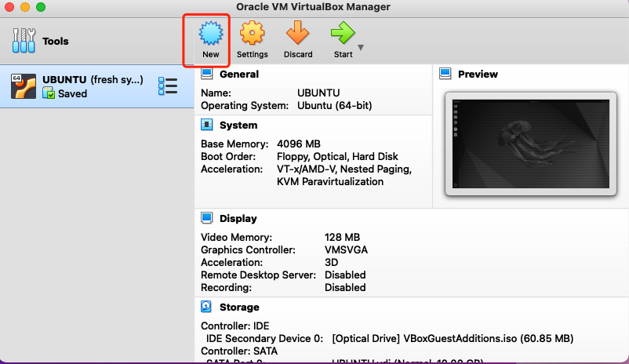
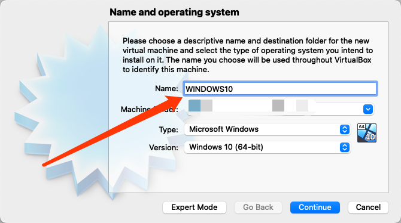
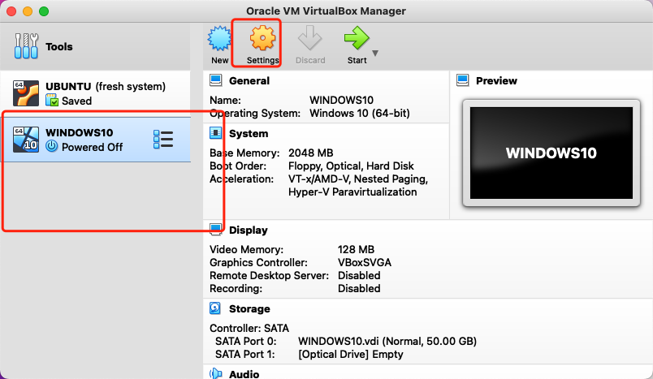
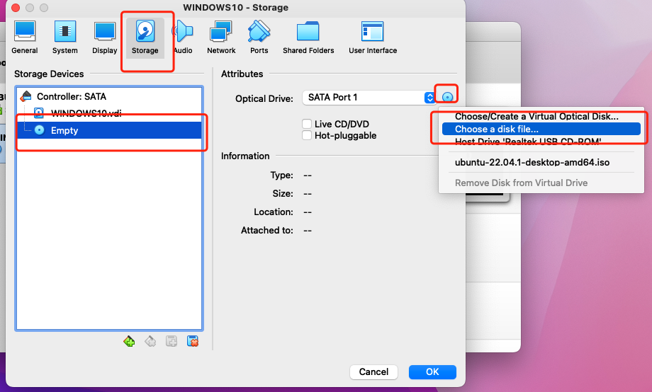
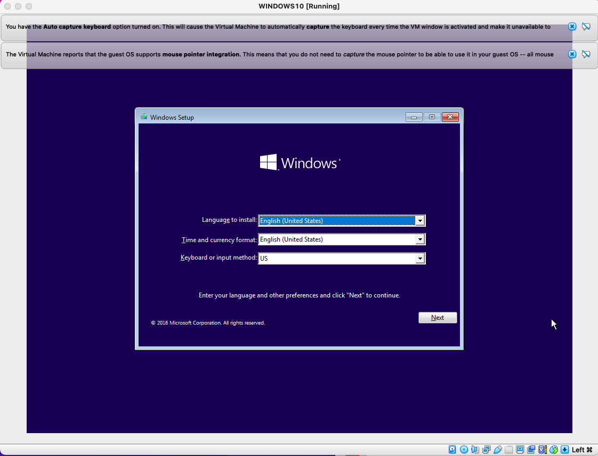
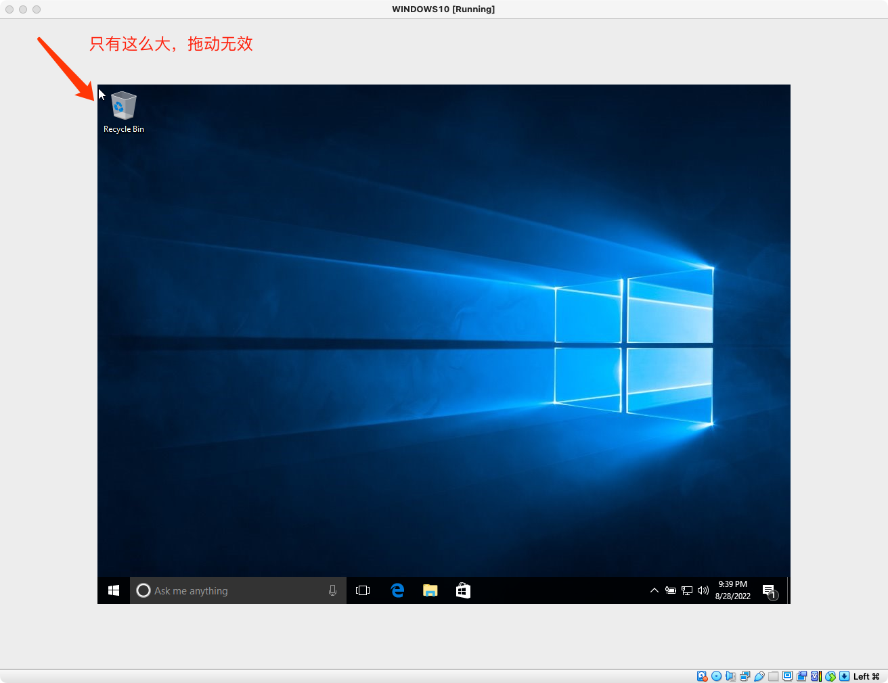
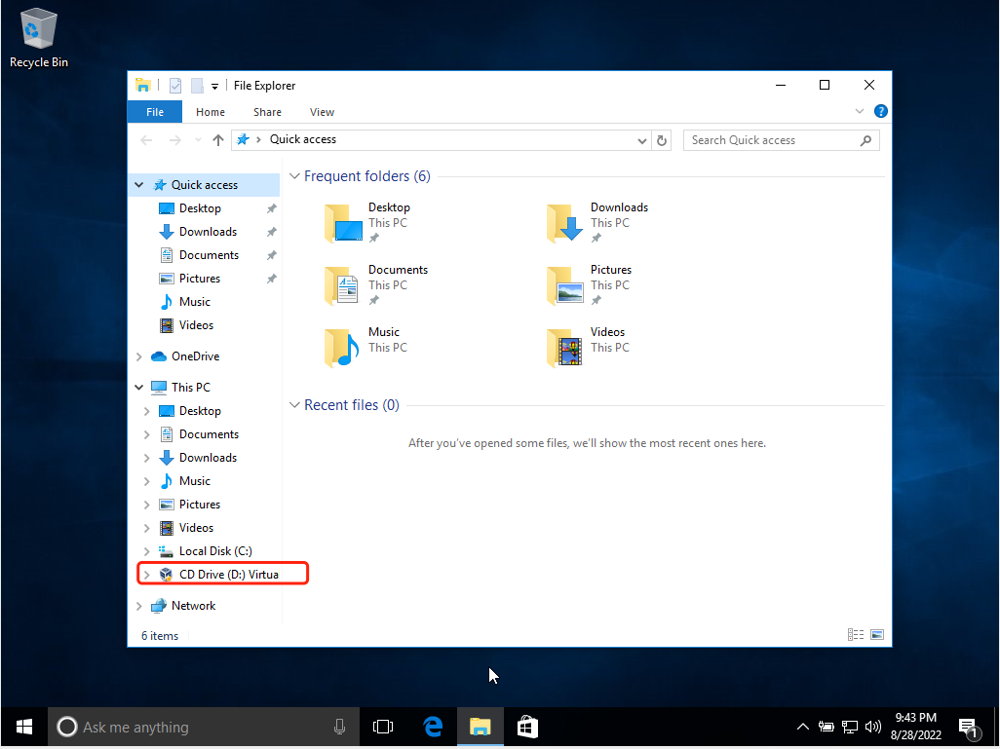
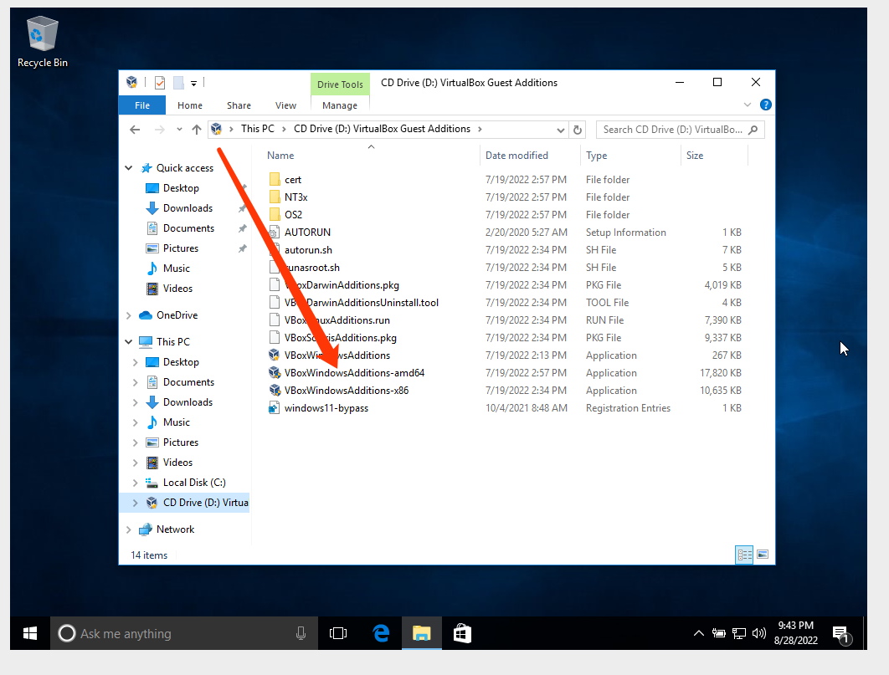

# 虚拟机安装WINDOWS10虚拟机

Virtualbox
笔者使用的虚拟机软件是VirtualBox。之所以没有使用大名鼎鼎的VMWARE，是因为笔者的MAC系统版本不兼容VMWARE的某些版本。

## 准备ISO文件

* 推荐在MSDN，我告诉你下载。[传送门](https://msdn.itellyou.cn/)

* 选择自己需要的版本，用迅雷下载下来。
搭建windows10虚拟机

* NEW

* 起个名字

* 后面一直继续直到完成

* 这时候还是没有加载ISO文件的，我们还需要去加载ISO文件

* 选择WINDOWS10(你自己刚才取的名字),点击SETTINGS

* 去storage的选项卡，然后选择EMPTY,点击右侧的小光盘，选择如图项

* 选择我们下载好的ISO文件， 确定就完成了

* 这个时候我们运行虚拟机，就可以进入windows10的安装页面了

* 安装的过程和我们系统装机是一样的，这里就不细表了。接下来我们说一说装好系统后的重要优化问题。

## 重要优化
### 屏幕不能放大

* 第一个可能遇到的问题是屏幕不能放大，分辨率不对，如这样

* 解决的方案是，选择devices->insert guest additions cd image。选择完成后，我们打开虚拟机中的文件管理器，发现计算机下多了一个盘，打开他

* 双击安装这个，重启虚拟机就解决了

### 虚拟机反应慢

* 第二个问题就是发现虚拟机比较卡顿，解决办法可以点击[链接](http://t.csdn.cn/zuJ5K)。教程是中文的，笔者就不重复说明了，跟着步骤来，笔者亲测可行
