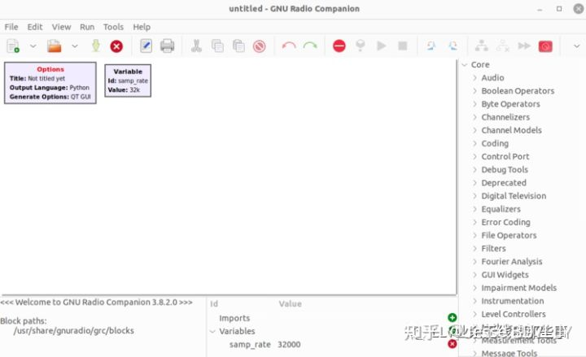
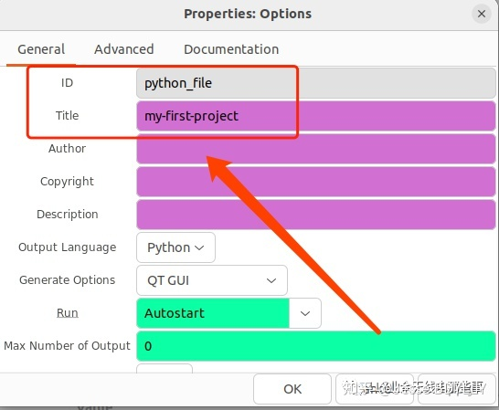
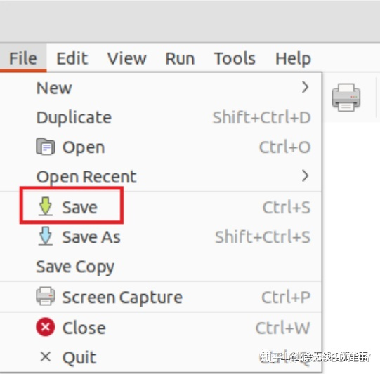
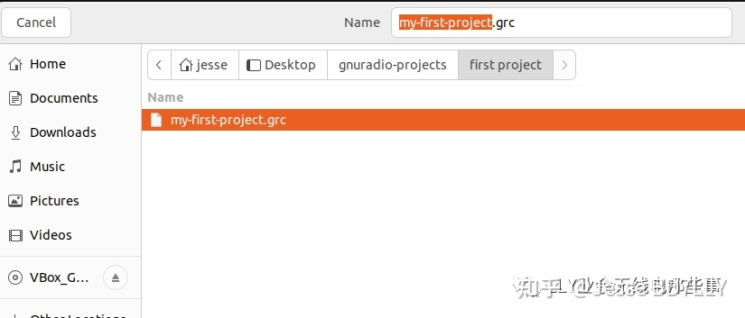
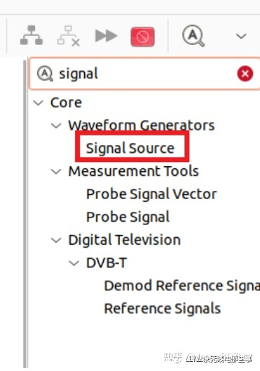
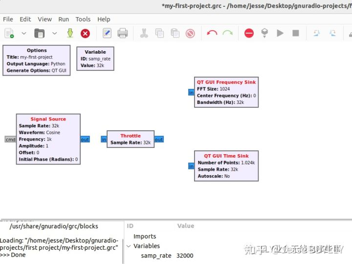
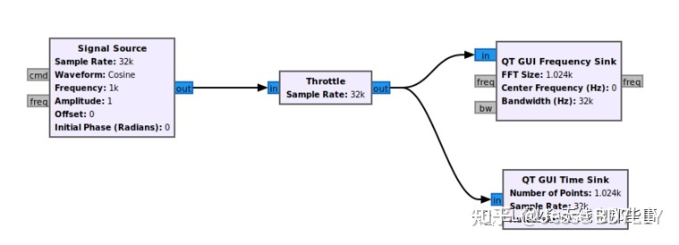
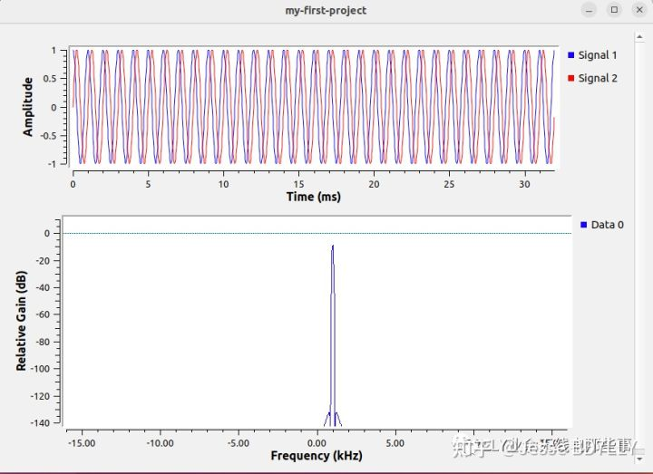
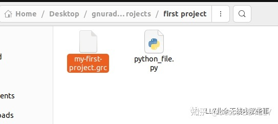

# 学习GNURadio系列2-第一个项目

安装好了环境，我们开始进行第一个项目。这个项目的教程来自GNURadio官网。(原文链接)

首先我们打开GNURadio. 这时我们看到两个模块(block,后续我们直接用英文代替) - 一个叫做’Options’, 另一个叫做’Variable’。

‘options’是给我们这个项目命名使用的。双击‘options’，我们需要修改’id’和’title’两项。

我们的项目后续会产生python文件，这个’id‘是这个python文件的名称。title是我们这个项目的名称。至于python文件有什么用和项目名称的含义，我们在这里先不去管他，先跟着教程走。

我们给python文件取名’python_file’, 项目名称叫做’my-first-project‘。改好之后直接点ok。

接下来点击’file‘选择保存我们的GRC项目(GNURadio项目的缩写)

选择保存的路径，并且去一个名字。笔者起的名字叫做’my-first-project’。

接下来我们正式开始操作项目了。在GNURadio界面的右边如图这里，是很多我们可以用的到的数字信号处理的blocks。我们今天会用到其中的4个blocks，为了快速定位可以点击搜索图标直接搜索名称(也可以control+F)。

4个blocks分别如下，我们搜索找到他们，并且双击搜索到的结果，他们会出现在我们GRC的工作界面当中 。

* signal source
* throttle
* QT GUI Frequency Sink
* QT GUI Time Sink

signal source这个block的作用是信号源，他会产生一个正弦波，QT GUI Frequency Sink的作用是显示出频谱当中的幅值，而QT GUI Time Sink是显示时域的状态。还有一个Throttle，他的作用是代替了硬件(笔者也不明白是什么意思，先不去管他)。

接下来我们需要连线，方法如下图。如第一步是把信号源的输出接在throttle的输入。

接下来我们运行一下。

出现了这样一个窗口，正是我们刚才项目产生的结果，信号源产生的信号，在时域和频域展示了他的输出内容。

这时我们去看一下我们刚才保存grc文件的地方，我们现在有两个文件了，一个是.py(python)文件，一个是我们刚才保存过的.grc文件。

我们的第一个项目成功了！在这个项目中，我们知道了最基础的GNURadio是怎么通过模拟和使用不同的信号处理模块，仿真一个真实的信号处理过程。当然，里面的很多东西我们现在可能还是懵懵懂懂的，没事，我们接着学。

试试吧，不要掉队哦!
