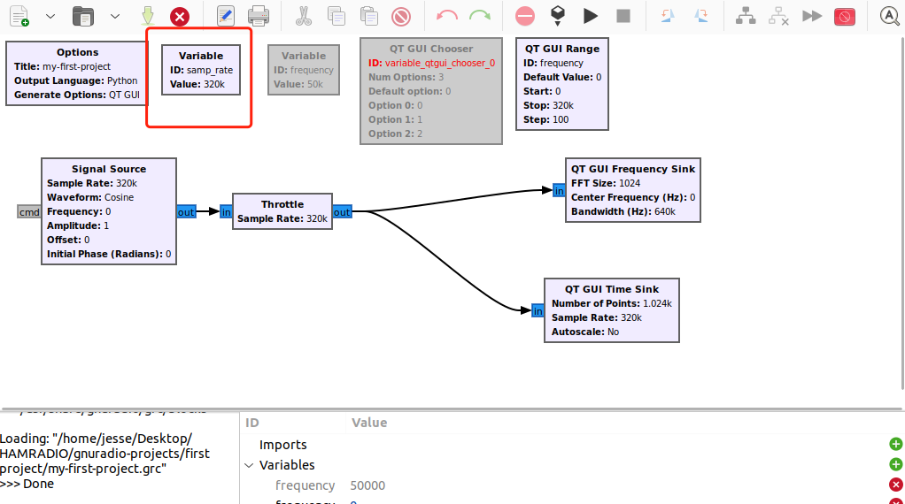
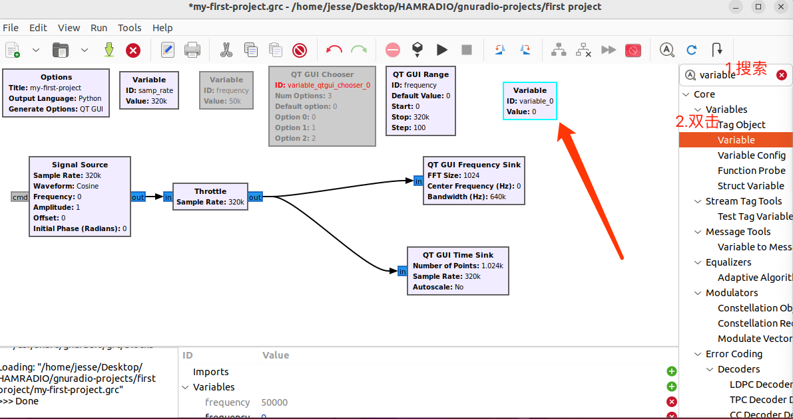
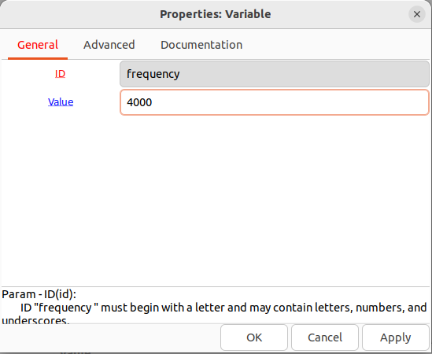
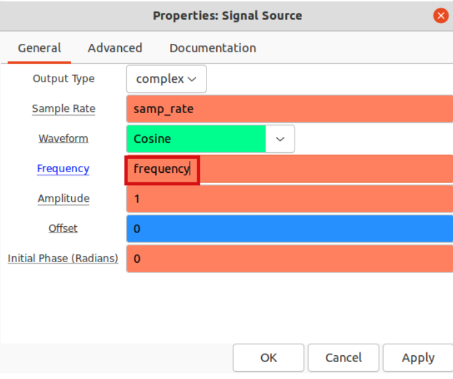
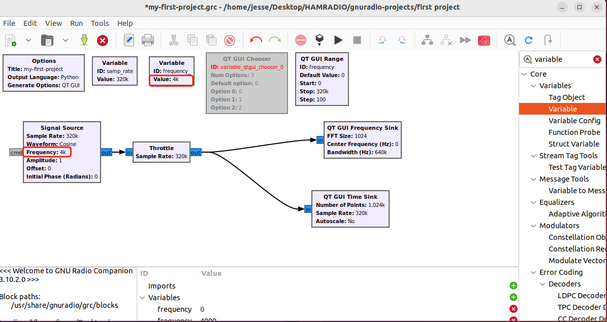
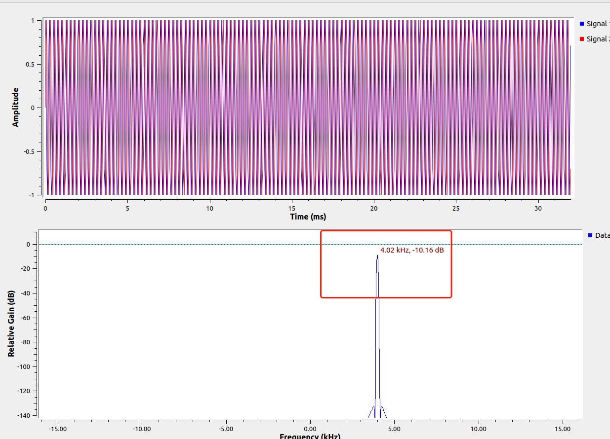
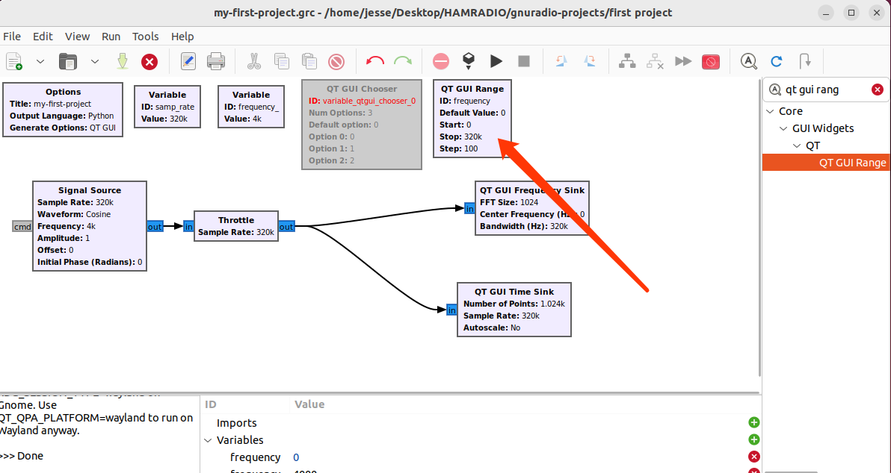
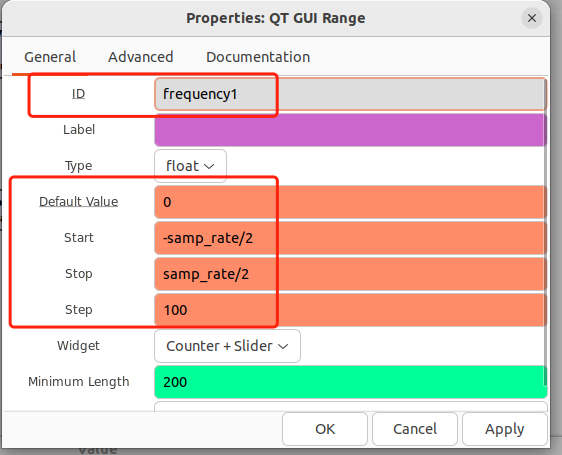
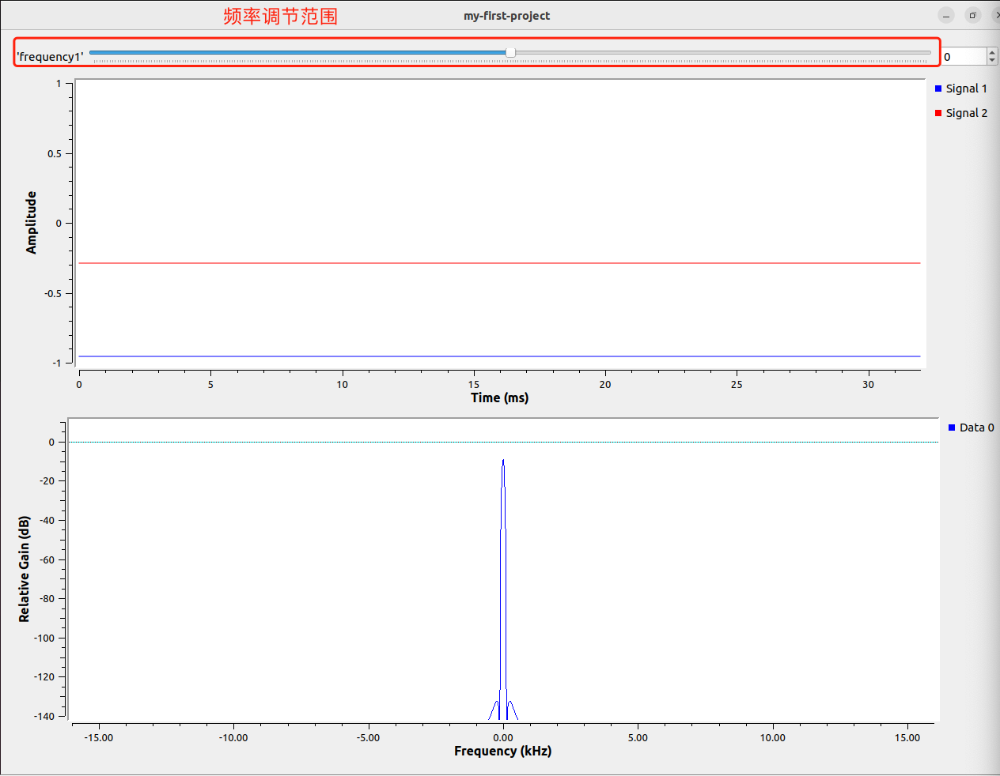

# 学习SDR之GNURadio系列3-GRC中的变量

## 浮点，整数，字符串，列表，元组

接触过一些编程的同学对这些应该都非常熟悉，我们再复习一下他的名字和对应的英文。

* 浮点(float):含小数点的数字，如1.2
* 整数(integer):不含小数点数字，如1
* 字符串(string): 由数字、字母、下划线组成的一串字符，如’my callsign is BD7LLY'
* 列表(list)：由一系列元素组成，用[]包起来，如[1，2，3，‘BD7LLY’,4,5]
* 元组(Tuple)：也是由一些列元组组成，用()包起来，如(1，2，3，‘BD7LLY’,4,5)

至于不同元素之间的区别，如list和tuple，我们这里不做介绍，因为目前还用不上。但有兴趣研究的小伙伴可以参考这一篇文章[点这里](https://blog.csdn.net/Fran_klin__/article/details/125069411)。

我们GNURadio Companion(GRC)的底层是python，GRC只是一个图形化的工具，他把我们画出的流程图，“翻译”成了python的语言，然后才去执行。所以，认识一下编程语言中不同数据结构的类型是有帮助的。

我们的GRC软件使用不同的颜色去区分不同的数据类型 - 比如
* float - 橙色
* integer - 绿色
* string - 紫色

## 在流向图中操作变量

那么我们如何在GRC中操作这些变量(数据/元素)呢？今天的例子里我们会用第一个项目的结果作为开始的起点，如果还没有实操第一个项目的小伙伴可以先去实操一下再来。

[学习GNURadio系列2-第一个项目](1)

正如我们前面所提到的，我们GRC的软件是基于python的，python中的变量(variable)，在GRC的流向图中用`Variable`这个block来定义。每次我们新建一个项目，GRC会自动给我们定义一个variable，就是`samp_rate`(采样率) - 这个很好理解。因为GRC是一个做信号处理的软件，采样率是最基本的变量。

这里咱们另外提一句，大家最好能够对我们时不时提到的英文单词(如Variable)对应的含义形成一定的印象，后面笔者会越来越多去直接使用英文，因为毕竟软件是英文的，对单词形成印象对我们使用软件会有很大的帮助。

好的我们继续。我们创建一个新的variable的block。

我们双击我们创建的的这个block做一些改变。我们创建的这个variable，他会是我们信号源(signal source)的频率，所以我们把这个variable的ID改成频率(frequency)，频率设置成4000。保存退出

然后我们双击第一个项目中创建的信号源(signal source)block，把frequency设置成我们刚刚创建的变量，像这样，然后保存退出

这是我们发现，流向图中，信号源的输出frequency就是我们设置变量的frequency了，也就是4000。

这是我们运行一下

这是我们再频谱图上可以看到，信号输出频率在4000左右。

## 运行中更改变量

我们接下来看看怎么在运行的过程中更改变量的数值，让我们实时查看变量改变导致的时域和频域上的变化。

我们会使用到另外一个block，叫做‘QT GUI Range’ - 这个block的作用就是在运行中让我们实时更改变量。同样的，我们查找，双击把这个block弄出来放在我们的工作区。

双击，修改他的值 -

* ID：frequency1 //这个1是因为我们刚才已经有个变量叫做frequency，避免重名。
* Default value：0 //这个是执行后，刚开始默认的频率设置
* start：-samp_rate/2 //采样率我们如果设置32k，即-32k/2= -16k
* stop: samp_rate/2 //同上理，为16k

我们运行一下

我们可以去用频率调节范围再运行当中调节频率的值，观察在时域和频域的变化。解释一下刚才设置的参数。

* 频率调节范围即刚才设置的start和stop的范围，-16k - 16k
* 刚开始运行是频率是0，因为我们设置的default value是0。

另外还有一个block叫做QT GUI Chooser，他的作用是选择几个设置好的频率。使用方法和上面的block是一个原理，小伙伴可以自己动手试一试。

好的，今天的教程就到这里。GNURadio的学习我们又进了一步，给自己鼓个掌吧!我们下期见！

=====欢迎关注我===========

我的微信公众号：LLY业余无线电那些事

我的知乎业余无线电专栏： https://www.zhihu.com/column/c_1392777577560424448

